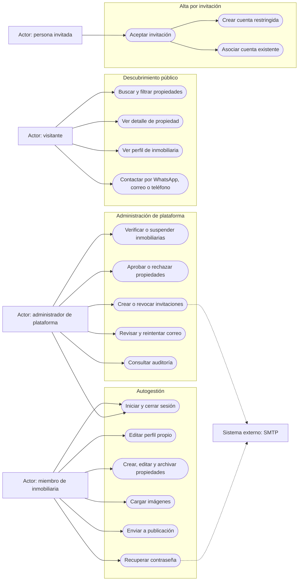

# Diagrama de casos de uso

El rol persistido `owner` o `editor` todavía no cambia permisos: ambos se comportan
como miembros de la inmobiliaria. El administrador de plataforma puede operar sobre
cualquier inmobiliaria.
