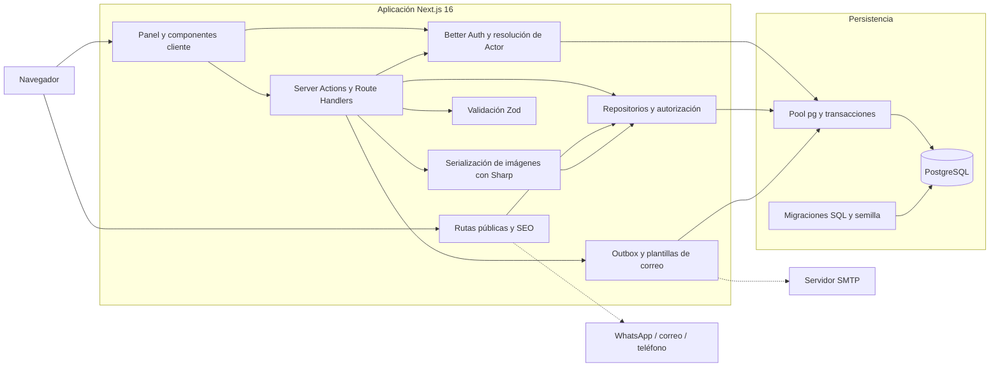

# Diagrama de componentes

```mermaid
flowchart LR
    Browser["Navegador"]

    subgraph Next["Aplicación Next.js 16"]
        PublicUI["Rutas públicas y SEO"]
        PanelUI["Panel y componentes cliente"]
        Actions["Server Actions y Route Handlers"]
        Auth["Better Auth y resolución de Actor"]
        Validation["Validación Zod"]
        Repositories["Repositorios y autorización"]
        Media["Serialización de imágenes con Sharp"]
        Email["Outbox y plantillas de correo"]
    end

    subgraph Data["Persistencia"]
        Pool["Pool pg y transacciones"]
        PostgreSQL[("PostgreSQL")]
        Migrations["Migraciones SQL y semilla"]
    end

    SMTP["Servidor SMTP"]
    WhatsApp["WhatsApp / correo / teléfono"]

    Browser --> PublicUI
    Browser --> PanelUI
    PanelUI --> Actions
    PanelUI --> Auth
    Actions --> Auth
    Actions --> Validation
    Actions --> Media
    Actions --> Repositories
    PublicUI --> Repositories
    Auth --> Pool
    Repositories --> Pool
    Email --> Pool
    Actions --> Email
    Pool --> PostgreSQL
    Migrations --> PostgreSQL
    Media --> Repositories
    Email -.-> SMTP
    PublicUI -.-> WhatsApp
```

La autorización se aplica cerca de los datos en los repositorios, no solo en la UI.
Los componentes cliente nunca acceden directamente a PostgreSQL ni reciben secretos.
