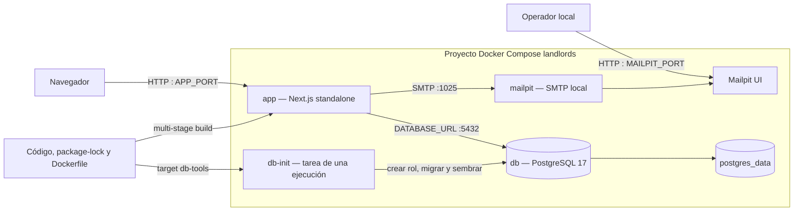

# Diagrama de despliegue

## Topología disponible: Docker Compose local

`db-init` debe terminar correctamente antes de iniciar `app`. PostgreSQL puede
publicar un puerto al host para desarrollo. Esta topología no es un despliegue de
producción: carece de TLS, proveedor SMTP real, copias verificadas, monitoreo y una
política de exposición de red.
