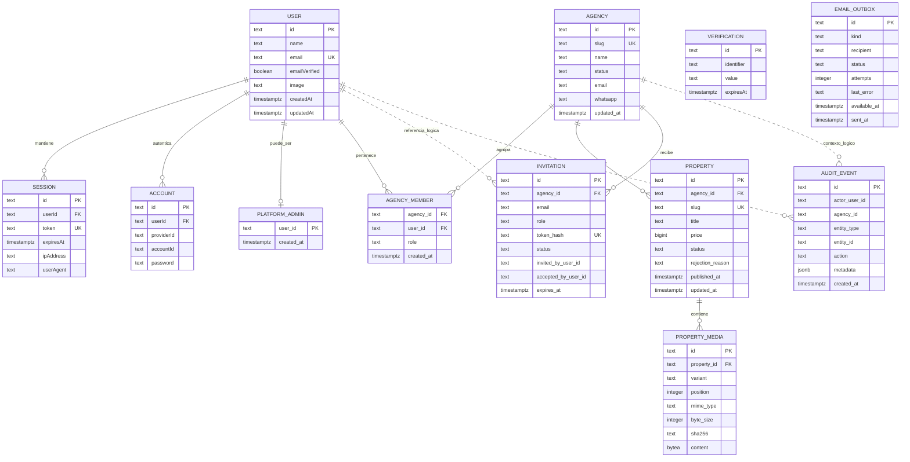

# Diagrama entidad-relación

`AUDIT_EVENT.actor_user_id`, `AUDIT_EVENT.agency_id` y los usuarios registrados en
`INVITATION` son referencias lógicas sin clave foránea. Esto permite conservar la
historia aunque se eliminen usuarios o agencias. `EMAIL_OUTBOX` no tiene una relación
física con `INVITATION`; ambas filas se crean en la misma transacción.
