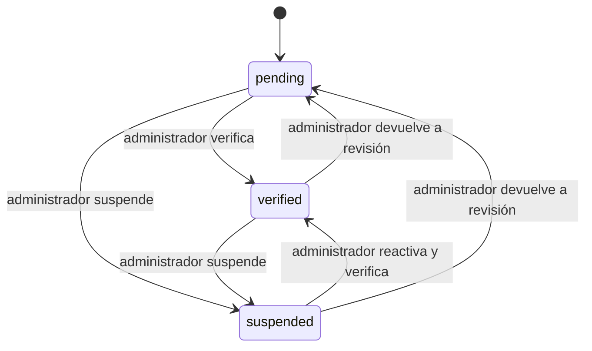
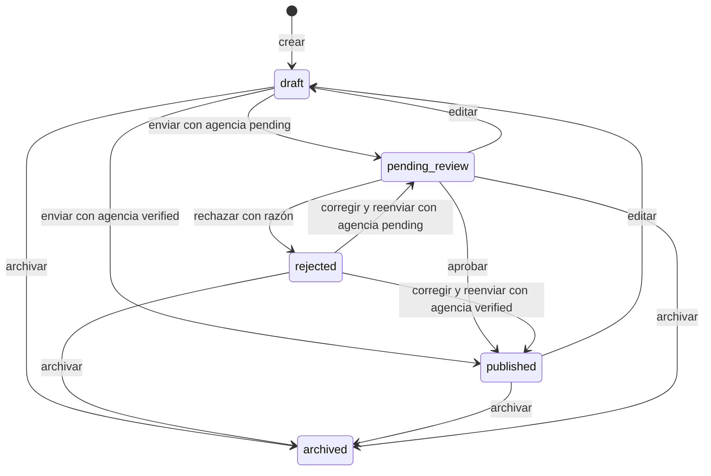
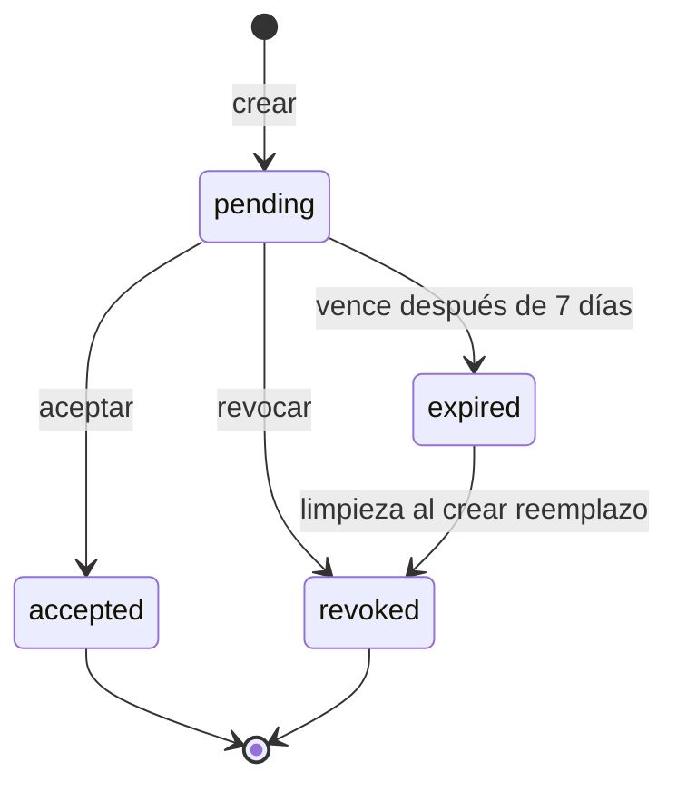
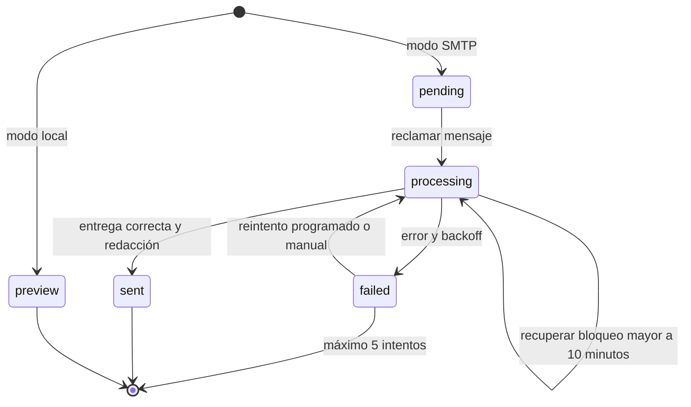

# Diagramas de estados del dominio

## Inmobiliaria

## Propiedad

La transición desde `rejected` hacia una corrección está prevista por la UI, pero
tiene una inconsistencia de implementación registrada en
[limitaciones conocidas](../limitaciones-conocidas.md).

## Invitación

`expired` es un estado calculado a partir de `expires_at`; la fila conserva `pending`
hasta que una operación la marque como `revoked`.

## Bandeja de salida

