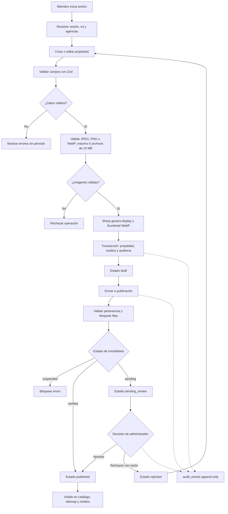

# Diagrama de flujo de publicación

Una inmobiliaria suspendida conserva publicaciones existentes, pero no puede enviar
nuevas propiedades. La edición de una publicación o revisión la devuelve a borrador.
Existe una incidencia conocida al editar una propiedad rechazada; se documenta en
[limitaciones conocidas](../limitaciones-conocidas.md).
