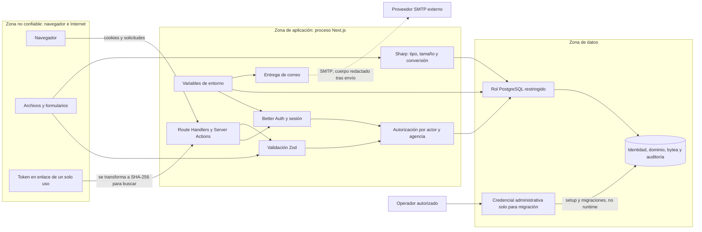

# Diagrama de límites de confianza

No existe cifrado de aplicación para imágenes o datos: TLS, cifrado en reposo,
rotación de secretos y aislamiento de red son responsabilidades del entorno de
despliegue. Tampoco hay rate limiting ni monitoreo implementados actualmente.
