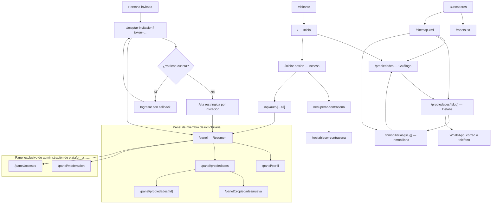

# Diagrama de navegación

```mermaid
flowchart TD
    Visitante["Visitante"] --> Inicio["/ — Inicio"]
    Inicio --> Catalogo["/propiedades — Catálogo"]
    Inicio --> Login["/iniciar-sesion — Acceso"]
    Catalogo --> Detalle["/propiedades/[slug] — Detalle"]
    Detalle --> Agencia["/inmobiliarias/[slug] — Inmobiliaria"]
    Agencia --> Catalogo
    Detalle --> Contacto["WhatsApp, correo o teléfono"]

    Login --> Recuperar["/recuperar-contrasena"]
    Recuperar --> Restablecer["/restablecer-contrasena"]
    Login --> AuthAPI["/api/auth/[...all]"]
    AuthAPI --> Panel["/panel — Resumen"]

    Invitado["Persona invitada"] --> Aceptar["/aceptar-invitacion?token=..."]
    Aceptar --> NuevaCuenta{"¿Ya tiene cuenta?"}
    NuevaCuenta -->|No| Registro["Alta restringida por invitación"]
    NuevaCuenta -->|Sí| LoginInvitado["Ingresar con callback"]
    Registro --> Panel
    LoginInvitado --> Aceptar
    Aceptar --> Panel

    subgraph Miembro["Panel de miembro de inmobiliaria"]
        Panel --> Perfil["/panel/perfil"]
        Panel --> Propiedades["/panel/propiedades"]
        Propiedades --> Nueva["/panel/propiedades/nueva"]
        Propiedades --> Editar["/panel/propiedades/[id]"]
    end

    subgraph Administracion["Panel exclusivo de administración de plataforma"]
        Panel --> Moderacion["/panel/moderacion"]
        Panel --> Accesos["/panel/accesos"]
    end

    Buscador["Buscadores"] --> Robots["/robots.txt"]
    Buscador --> Sitemap["/sitemap.xml"]
    Sitemap --> Catalogo
    Sitemap --> Detalle
    Sitemap --> Agencia
```

El layout de `/panel` redirige sesiones ausentes a `/iniciar-sesion`. Las rutas
administrativas además vuelven a comprobar `platformAdmin` en lectura y mutación.
