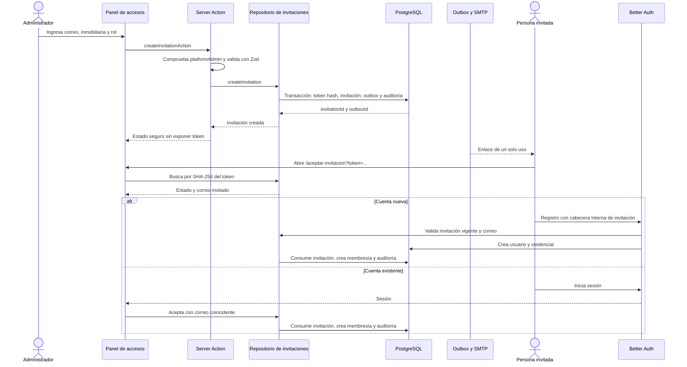
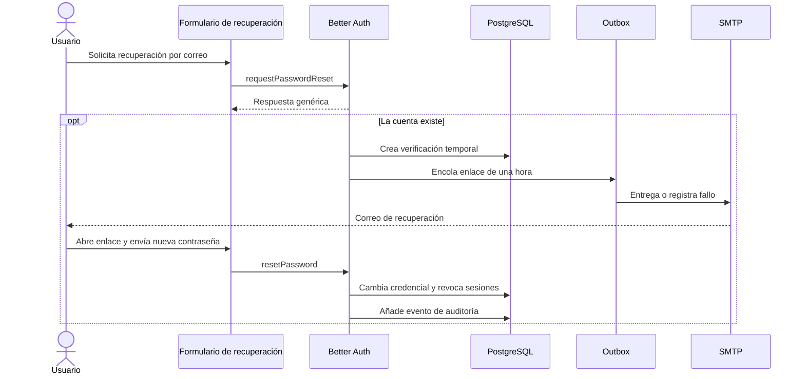

# Diagramas de secuencia de identidad

## Invitación y alta

```mermaid
sequenceDiagram
    actor Admin as Administrador
    participant UI as Panel de accesos
    participant Action as Server Action
    participant Repo as Repositorio de invitaciones
    participant DB as PostgreSQL
    participant Mail as Outbox y SMTP
    actor Guest as Persona invitada
    participant Auth as Better Auth

    Admin->>UI: Ingresa correo, inmobiliaria y rol
    UI->>Action: createInvitationAction
    Action->>Action: Comprueba platformAdmin y valida con Zod
    Action->>Repo: createInvitation
    Repo->>DB: Transacción: token hash, invitación, outbox y auditoría
    DB-->>Repo: invitationId y outboxId
    Repo-->>Action: Invitación creada
    Action-->>UI: Estado seguro sin exponer token
    Mail-->>Guest: Enlace de un solo uso
    Guest->>UI: Abre /aceptar-invitacion?token=...
    UI->>Repo: Busca por SHA-256 del token
    Repo-->>UI: Estado y correo invitado
    alt Cuenta nueva
        Guest->>Auth: Registro con cabecera interna de invitación
        Auth->>Repo: Valida invitación vigente y correo
        Auth->>DB: Crea usuario y credencial
        Repo->>DB: Consume invitación, crea membresía y auditoría
    else Cuenta existente
        Guest->>Auth: Inicia sesión
        Auth-->>UI: Sesión
        UI->>Repo: Acepta con correo coincidente
        Repo->>DB: Consume invitación, crea membresía y auditoría
    end
```

## Recuperación de contraseña

```mermaid
sequenceDiagram
    actor User as Usuario
    participant UI as Formulario de recuperación
    participant Auth as Better Auth
    participant DB as PostgreSQL
    participant Outbox as Outbox
    participant SMTP as SMTP

    User->>UI: Solicita recuperación por correo
    UI->>Auth: requestPasswordReset
    Auth-->>UI: Respuesta genérica
    opt La cuenta existe
        Auth->>DB: Crea verificación temporal
        Auth->>Outbox: Encola enlace de una hora
        Outbox->>SMTP: Entrega o registra fallo
        SMTP-->>User: Correo de recuperación
        User->>UI: Abre enlace y envía nueva contraseña
        UI->>Auth: resetPassword
        Auth->>DB: Cambia credencial y revoca sesiones
        Auth->>DB: Añade evento de auditoría
    end
```
